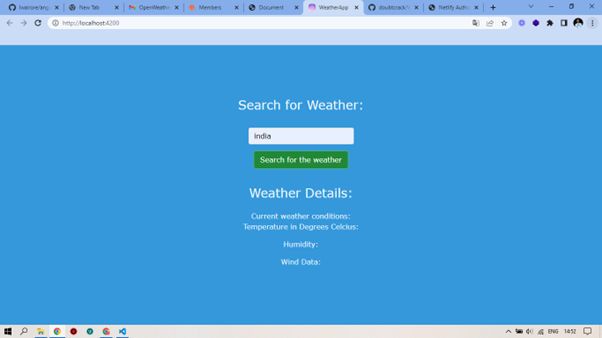

# Angular Weather App

Angular Weather app is an Angular application that uses Angular, Bootstrap, and the APIXU API. This application allows a user to be able to type a location into a search form and on submission of that form, they're able to see the current weather details for that location they searched for.
